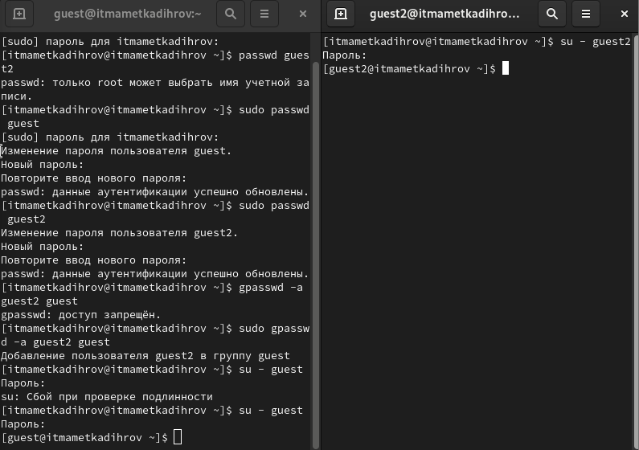
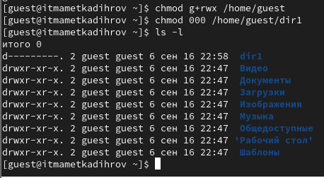

---
# Front matter
lang: russian
title: "Отчёт по лабораторной работе № 3"
subtitle: "Дисциплина: Основы информационной безопасности"
author: "Маметкадыров Ынтымак"

# Formatting
toc-title: "Содержание"
toc: true # Table of contents
toc_depth: 2
lof: true # List of figures
fontsize: 12pt
linestretch: 1.5
papersize: a4paper
documentclass: scrreprt
polyglossia-lang: russian
polyglossia-otherlangs: english
mainfont: PT Serif
romanfont: PT Serif
sansfont: PT Sans
monofont: PT Mono
mainfontoptions: Ligatures=TeX
romanfontoptions: Ligatures=TeX
sansfontoptions: Ligatures=TeX,Scale=MatchLowercase
monofontoptions: Scale=MatchLowercase
indent: true
pdf-engine: lualatex
header-includes:
  - \usepackage{ctablestack}
  - \linepenalty=10 # the penalty added to the badness of each line within a paragraph (no associated penalty node) Increasing the value makes TeX try to have fewer lines in the paragraph.
  - \interlinepenalty=0 # value of the penalty (node) added after each line of a paragraph.
  - \hyphenpenalty=50 # the penalty for line breaking at an automatically inserted hyphen
  - \exhyphenpenalty=50 # the penalty for line breaking at an explicit hyphen
  - \binoppenalty=700 # the penalty for breaking a line at a binary operator
  - \relpenalty=500 # the penalty for breaking a line at a relation
  - \clubpenalty=150 # extra penalty for breaking after the first line of a paragraph
  - \widowpenalty=150 # extra penalty for breaking before the last line of a paragraph
  - \displaywidowpenalty=50 # extra penalty for breaking before the last line before a display math
  - \brokenpenalty=100 # extra penalty for page breaking after a hyphenated line
  - \predisplaypenalty=10000 # penalty for breaking before a display
  - \postdisplaypenalty=0 # penalty for breaking after a display
  - \floatingpenalty=20000 # penalty for splitting an insertion (can only be split footnote in standard LaTeX)
  - \raggedbottom # or \flushbottom
  - \usepackage{float} # keep figures where they are in the text
  - \floatplacement{figure}{H} # keep figures where they are in the text
---

# Цель работы

Получить навыки работы в консоли с правами и атрибутами файлов и директорий ***для групп пользователей***, 
а также проверка необходимых прав для выполнения различных действий для работы с файлами и диреториями.

# Теоретическое введение

Атрибуты --- это набор основных девяти битов, определяющих какие из пользователей обладают правами на чтение, запись
и исполнение. 
Первые три бита отвечают права доступа владельца, вторые --- для группы пользователей, последние --- для всех остальных
пользователей в системе.

Установка атрибутов производится командой chmod. Установка бита чтения (r) позволяет сделать файл доступным для чтения. 
Наличие бита записи (w) позволяет изменять файл. Установка бита запуска (x) позволяет запускать файл на исполнение.
 
Более подробно см. в [@gnu-doc:bash].

В ОС Linux, группа --- это набор пользователей. Основная цель групп --- это определить права на чтение, запись и исполнение
сразу для нескольких пользователей, состоящих в группе. Так же пользователи могут быть добавлены в уже существующие группы для
получения их прав.

Группы бывают двух видов:

- Первичная группа --- это группа, приписанная к файлам, созданным пользователем. Обычно имя первичной группы совпадает с именем
пользователя. У каждого пользователя может быть только одна первичная группа.
- Вторичная группа --- используется для определения прав для набора пользователей. Пользователь может состоять в нескольких вторичных группах или не состоять ни в одной.

Более подробно см. в [@gnu-doc-1:bash]

# Выполнение лабораторной работы

Создаём нового пользователя guest2 командой useradd, затем устанавливаем для него пароль с помощью команды passwd guest2 (рис. [-@fig:001]).

{ #fig:001 width=70% }

Добавляем пользователя guest2 в группу guest командой gpasswd -a.

Заходим в систему от имени пользователей guest, и guest2 на двух терминалах, используя команду su - <имя пользователя> и только что установленный пароль. 

Выполняем команду pwd, которая показывает, что мы находимся в соответствующих домашних каталогах пользователей. Уточняем имя 
пользователя командой whoami, ожидаемо получаем вывод guest и guest2 соответственно. Определяем группы, в которых состоят пользователи командой groups. Пользователь guest состоит только в группе guest, а пользователь guest2 состоит в двух группах --- guest и guest2. Эту же информацию можно узнать с помощью команды id -Gn (рис. [-@fig:002]).

{ #fig:002 width=70% }

В содержимом файла /etc/passwd находим информацию о группах, в которых состоят пользователи, что соответствует данным, полученным с помощью команды id и groups. От имени пользователя guest2 выполняем регистрацию пользователя в группе командой newgrp (рис. [-@fig:003]).

{ #fig:003 width=70% }

От имени пользователя guest изменяем права на директорию /home/guest, чтобы пользователи в группе получили доступ к файлам в домашнем каталоге. Также меняем директории dir1 атрибуты с помощью команды chmod 000. Далее проверяем изменения командой ls -l (рис. [-@fig:004]).

{ #fig:004 width=70% }

Далее изучим, как влияют различные комбинации атрибутов файлов и директории на различные действия. Будем менять атрибуты файлов от имени пользователя guest командой chmod. А от имени пользователя guest2 будем пытаться создать файл командой touch, удалить его командой rm, записать в файл командой echo >, прочитать файл командой cat, сменить директорию командой cd, просмотреть директорию командой ls, переименовать файл командой rename и сменить атрибуты командой chattr.

В случае успеха будет записывать +, в случае ошибки доступа будем записывать -. Соберём данные в таблицу [-@tbl:std-dir-2].

: Установленные права и разрешённые действия {#tbl:std-dir-2}

| Права директории | Права файла | Создание файла | Удаление файла | Запись в файл | Чтение файла | Смена директории | Просмотр файлов в директории | Переименование файла | Смена атрибутов файла |
| ---------------- | ----------- | -------------- | -------------- | ------------- | ------------ | ---------------- | ------------------- | ----------- | ------------ |
| d (000) | (000) | - | - | - | - | - | - | - | - |
| d --x (010) | (000) | - | - | - | - | + | - | - | - |
| d -w- (020) | (000) | - | - | - | - | - | - | - | - |
| d -wx (030) | (000) | + | + | - | - | + | - | + | - |
| d r-- (040) | (000) | - | - | - | - | - | + | - | - |
| d r-x (050) | (000) | - | - | - | - | + | + | - | - |
| d rw- (060) | (000) | - | - | - | - | - | + | - | - |
| d rwx (070) | (000) | + | + | - | - | + | + | + | - |
| d (000) | --x (100) | - | - | - | - | - | - | - | - |
| d --x (010) | --x (010) | - | - | - | - | + | - | - | - |
| d -w- (020) | --x (010) | - | - | - | - | - | - | - | - |
| d -wx (030) | --x (010) | + | + | - | - | + | - | + | - |
| d r-- (040) | --x (010) | - | - | - | - | - | + | - | - |
| d r-x (050) | --x (010) | - | - | - | - | + | + | - | - |
| d rw- (060) | --x (010) | - | - | - | - | - | + | - | - |
| d rwx (070) | --x (010) | + | + | - | - | + | + | + | - |
| d (000) | -w- (020) | - | - | - | - | - | - | - | - |
| d --x (010) | -w- (020) | - | - | + | - | + | - | - | - |
| d -w- (020) | -w- (020) | - | - | - | - | - | - | - | - |
| d -wx (030) | -w- (020) | + | + | + | - | + | - | + | - |
| d r-- (040) | -w- (020) | - | - | - | - | - | + | - | - |
| d r-x (050) | -w- (020) | - | - | + | - | + | + | - | - |
| d rw- (060) | -w- (020) | - | - | - | - | - | + | - | - |
| d rwx (070) | -w- (020) | + | + | + | - | + | + | + | - |
| d (000) | -wx (030) | - | - | - | - | - | - | - | - |
| d --x (010) | -wx (030) | - | - | + | - | + | - | - | - |
| d -w- (020) | -wx (030) | - | - | - | - | - | - | - | - |
| d -wx (030) | -wx (030) | + | + | + | - | + | - | + | - |
| d r-- (040) | -wx (030) | - | - | - | - | - | + | - | - |
| d r-x (050) | -wx (030) | - | - | + | - | + | + | - | - |
| d rw- (060) | -wx (030) | - | - | - | - | - | + | - | - |
| d rwx (070) | -wx (030) | + | + | + | - | + | + | + | - |
| d (000) | r-- (040) | - | - | - | - | - | - | - | - |
| d --x (010) | r-- (040) | - | - | - | + | + | - | - | - |
| d -w- (020) | r-- (040) | - | - | - | - | - | - | - | - |
| d -wx (030) | r-- (040) | + | + | - | + | + | - | + | - |
| d r-- (040) | r-- (040) | - | - | - | - | - | + | - | - |
| d r-x (050) | r-- (040) | - | - | - | + | + | + | - | - |
| d rw- (060) | r-- (040) | - | - | - | - | - | + | - | - |
| d rwx (070) | r-- (040) | + | + | - | + | + | + | + | - |
| d (000) | r-x (050) | - | - | - | - | - | - | - | - |
| d --x (010) | r-x (050) | - | - | - | + | + | - | - | - |
| d -w- (020) | r-x (050) | - | - | - | - | - | - | - | - |
| d -wx (030) | r-x (050) | + | + | - | + | + | - | + | - |
| d r-- (040) | r-x (050) | - | - | - | - | - | + | - | - |
| d r-x (050) | r-x (050) | - | - | - | + | + | + | - | - |
| d rw- (060) | r-x (050) | - | - | - | - | - | + | - | - |
| d rwx (070) | r-x (050) | + | + | - | + | + | + | + | - |
| d (000) | rw- (060) | - | - | - | - | - | - | - | - |
| d --x (010) | rw- (060) | - | - | + | + | + | - | - | - |
| d -w- (020) | rw- (060) | - | - | - | - | - | - | - | - |
| d -wx (030) | rw- (060) | + | + | + | + | + | - | + | - |
| d r-- (040) | rw- (060) | - | - | - | - | - | + | - | - |
| d r-x (050) | rw- (060) | - | - | + | + | + | + | - | - |
| d rw- (060) | rw- (060) | - | - | - | - | - | + | - | - |
| d rwx (070) | rw- (060) | + | + | + | + | + | + | + | - |
| d (000) | rwx (070) | - | - | - | - | - | - | - | - |
| d --x (010) | rwx (070) | - | - | + | + | + | - | - | - |
| d -w- (020) | rwx (070) | - | - | - | - | - | - | - | - |
| d -wx (030) | rwx (070) | + | + | + | + | + | - | + | - |
| d r-- (040) | rwx (070) | - | - | - | - | - | + | - | - |
| d r-x (050) | rwx (070) | - | - | + | + | + | + | - | - |
| d rw- (060) | rwx (070) | - | - | - | - | - | + | - | - |
| d rwx (070) | rwx (070) | + | + | + | + | + | + | + | - |

В сравнении с таблицей из Лабораторной работы №2 мы видим, что изменилась только возможность изменять атрибуты файлов. Это
связано с тем, что во всех комбинациях стоит 0 в начале, что означает отсутствие прав у владельца файла и директории. Остальные же действия доступны как владельцу, так и членам группы, в равной степени при должной конфигурации прав.

На основании этой таблицы создадим другую, в которой опишем минимальные требования на права и директорию для выполнения тех или иных действий. Внесём проанализированные данные в таблицу [-@tbl:std-dir1]. 

: Минимальные права для совершения операций {#tbl:std-dir1}

| Операция | Минимальные права на директорию | Минимальные права на файл |
| -------- | ------------------------------- | ------------------------- |
| Создание файла | d -wx (300) | --- (000) |
| Удаление файла | d -wx (300) | --- (000) |
| Чтение файла | d --x (100) | r-- (400) |
| Запись в файл | d --x (100) | -w- (200) |
| Переименование файла | d -wx (300) | --- (000) |
| Создание поддиректории | d -wx (300) | --- (000) |
| Удаление поддиректории | d -wx (300) | --- (000) |

# Выводы

Приобрели практические навыки работы с атрибутами директорий и файлов в группе пользователей через консоль, выяснили минимальные требования и права для совершения различных действий над файлами и директориями.

# Список литературы

* Медведовский И.Д., Семьянов П.В., Платонов В.В. Атака через Internet. — НПО "Мир и семья-95",  1997. — URL: http://bugtraq.ru/library/books/attack1/index.html
* Медведовский И.Д., Семьянов П.В., Леонов Д.Г.  Атака на Internet. — Издательство ДМК, 1999. — URL: http://bugtraq.ru/library/books/attack/index.html
* Запечников С. В. и др. Информационн~пасность открытых систем. Том 1. — М.: Горячаая линия -Телеком, 2006.
* Введение в информационную безопасность. Типы уязвимостей. (Д.Гамаюнов, МГУ)
* Практические аспекты сетевой безопасности. Вводная лекция. Сетевая безопасность. Стек протоколов TCP/IP. (Д. Гамаюнов, МГУ)
* Практические аспекты сетевой безопасности. Сетевая безопасность. Межсетевые экраны. (В. Иванов, МГУ)
* Практические аспекты сетевой безопасности. Сетевая безопасность. Системы обнаружения и фильтрации компьютерных атак (IDS/IPS). (Д. Гамаюнов, МГУ)
* Практические аспекты сетевой безопасности. Контроль нормального поведения приложений. Security Enhanced Linux (SELinux) (В. Сахаров, МГУ)
