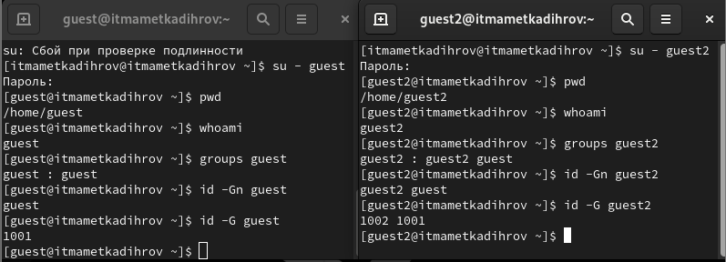

---
## Front matter
lang: russian
title: Отчет по лабораторной работе №3
author: Маметкадыров Ынтымак

## Formatting
mainfont: PT Sans
romanfont: PT Sans
sansfont: PT Sans
monofont: PT Sans
toc: false
slide_level: 2
theme: metropolis
aspectratio: 43
section-titles: true
---

# Дискреционное разграничение прав в Linux. Два пользователя

## Цель лабораторной работы

- Получить навыки работы с атрибутами файлов в группах пользователей через консоль
- Изучить влияние атрибутов на различные действия внутри группы

## Задачи лабораторной работы

- Создать ещё одного нового пользователя
- Создать группу пользователей
- От его лица изучить основные команды для работы с атрибутами внутри группы
- На конкретной директории и файле изучить влияние атрибутов на основные дейтсвия

# Ход выполнения лабораторной работы

## Создание нового пользователя

Создаём нового пользователя с помощью команды useradd и устанавливаем для него пароль командой passwd.

## Создание группы пользователей

Заходим в систему от имени пользователей guest и guest2 и добавлям последнего пользователя в группу к первому. Далее узнаём группы, в которых они cостоят состоит, с помощью команд groups и id.

## Регистрация пользователя в группе

Регистрируем пользователя командой newgrp.

## Смена прав доступа

- Смена основных атрибутов осуществляется с помощью команды chmod.
- Проверка атрибутов осуществляется командой ls -l.

## Разрешённые действия

Изменяя атрибуты директории dir1 и файла file1 от имени пользователя guest в этой директории, получаем таблицу с действиями, которые можно и нельзя осуществлять от лица пользователя guest2 с определённой конбинацией прав доступа.

## Минимальные требования

На основе полученных данных узнаём минимально необходимые права для осуществления тех или иных действий над файлом и директорией.

## Выводы 

- Приобрели практические навыки по работе с атрибутами файлов и директорий в группах пользователей в консоли
- Изучили и нашли минимальные права доступа, необходимые для работы с файлами и директориями и группами пользователей
