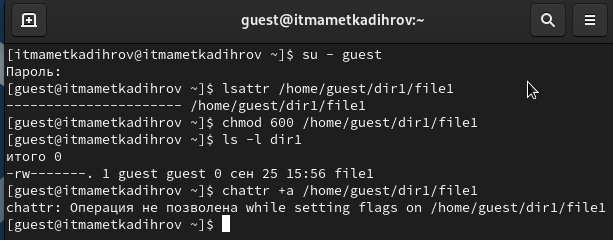
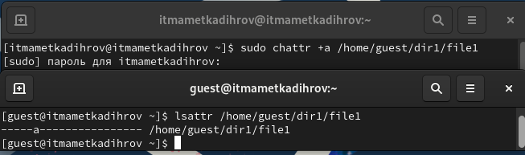
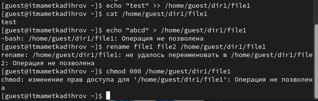
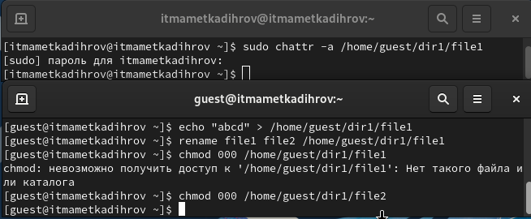
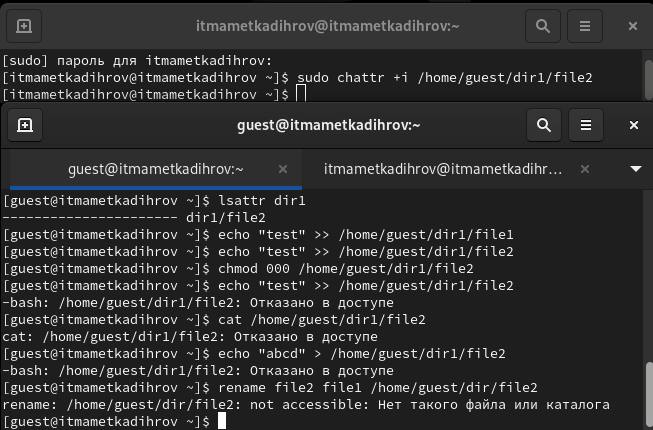

---
## Front matter
lang: russian
title: Отчет по лабораторной работе №4
subtitle: Основы информационной безопасности
author: Маметкадыров Ынтымак
institute:
  - Российский университет дружбы народов, Москва, Россия
  - НПМбд-02-20

## Formatting
mainfont: PT Sans
romanfont: PT Sans
sansfont: PT Sans
monofont: PT Sans
toc: false
slide_level: 2
theme: metropolis
aspectratio: 43
section-titles: true
---

# Дискреционное разграничение прав в Linux. Расширенные атрибуты

## Цель лабораторной работы

- Получить навыки работы с расширенными атрибутами через консоль

## Задачи лабораторной работы

- Просмотреть расширенные атрибуты файлов
- Изменить расширенные атрибуты a и i файлов через администратора
- Совершить ряд действий над файлом и изучить результат

# Ход выполнения лабораторной работы

## Просмотр расширенных атрибутов 

- От имени пользователя guest просматриваем расширенные атрибуты файла.
- При попытке добавить расширенный атрибут видим ошибку.

## Изменение расширенных атрибутов

- От имени администратора добавляем расширенный атрибут a.

## Проверка действий

- Дописываем в файл информацию командой echo >> и проверяем выполнение командой cat.
- При попытке удаления информации из файла, переименования файла и смены атрибутов получаем ошибку. 

## Проверка действий

- Через администратора убираем атрибут а.
- Теперь не возникает ошибки при удалении информации из файла, переименовании файла и смене атрибутов --- действия спокойно выполняются.

## Проверка действий.

- Через администратора добавляем атрибут i.
- Можем прочитать файл командой cat.
- При попытке дозаписи в файл, удалиния информации из файла, переименования файла и смены атрибутов получаем ошибку.

## Выводы

- Приобрели практические навыки по работе с расширенными атрибутами.
- Изучили влияние расширенных атрибутов a и i на действия с файлами.
