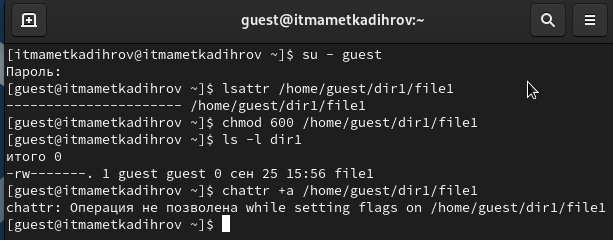
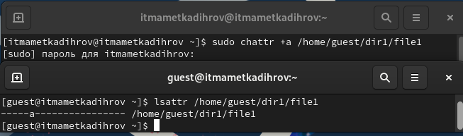
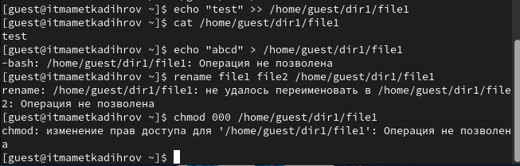
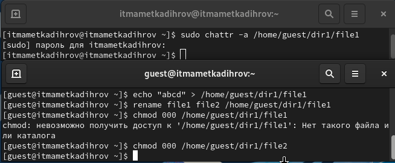
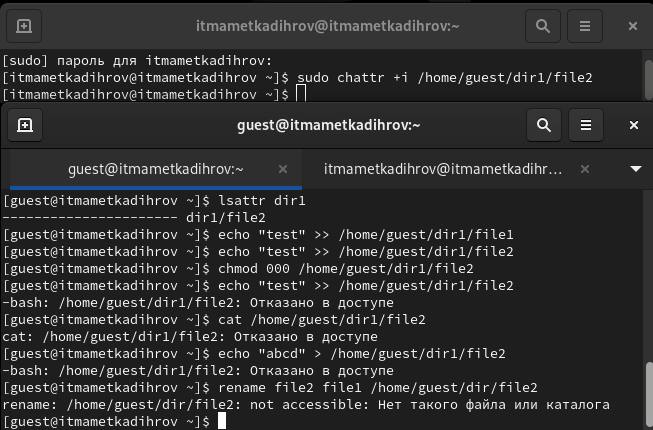

---
# Front matter
lang: russian
title: "Отчёт по лабораторной работе №4"
subtitle: "Дисциплина: Основы информационной безопасности"
author: "Маметкадыров Ынтымак, НПМбд-02-20"

# Formatting
toc-title: "Содержание"
toc: true # Table of contents
toc_depth: 2
lof: true # List of figures
fontsize: 12pt
linestretch: 1.5
papersize: a4paper
documentclass: scrreprt
polyglossia-lang: russian
polyglossia-otherlangs: english
mainfont: PT Serif
romanfont: PT Serif
sansfont: PT Sans
monofont: PT Mono
mainfontoptions: Ligatures=TeX
romanfontoptions: Ligatures=TeX
sansfontoptions: Ligatures=TeX,Scale=MatchLowercase
monofontoptions: Scale=MatchLowercase
indent: true
pdf-engine: lualatex
header-includes:
  - \usepackage{ctablestack}
  - \linepenalty=10 # the penalty added to the badness of each line within a paragraph (no associated penalty node) Increasing the value makes TeX try to have fewer lines in the paragraph.
  - \interlinepenalty=0 # value of the penalty (node) added after each line of a paragraph.
  - \hyphenpenalty=50 # the penalty for line breaking at an automatically inserted hyphen
  - \exhyphenpenalty=50 # the penalty for line breaking at an explicit hyphen
  - \binoppenalty=700 # the penalty for breaking a line at a binary operator
  - \relpenalty=500 # the penalty for breaking a line at a relation
  - \clubpenalty=150 # extra penalty for breaking after the first line of a paragraph
  - \widowpenalty=150 # extra penalty for breaking before the last line of a paragraph
  - \displaywidowpenalty=50 # extra penalty for breaking before the last line before a display math
  - \brokenpenalty=100 # extra penalty for page breaking after a hyphenated line
  - \predisplaypenalty=10000 # penalty for breaking before a display
  - \postdisplaypenalty=0 # penalty for breaking after a display
  - \floatingpenalty=20000 # penalty for splitting an insertion (can only be split footnote in standard LaTeX)
  - \raggedbottom # or \flushbottom
  - \usepackage{float} # keep figures where they are in the text
  - \floatplacement{figure}{H} # keep figures where they are in the text
---

# Цель работы

Получить навыки работы в консоли с расширенными атрибутами файлов.

# Теоретическое введение

Атрибуты --- это набор основных девяти битов, определяющих какие из пользователей обладают правами на чтение, запись
и исполнение. 
Первые три бита отвечают права доступа владельца, вторые --- для группы пользователей, последние --- для всех остальных
пользователей в системе.

Установка атрибутов производится командой chmod. Установка бита чтения (r) позволяет сделать файл доступным для чтения. 
Наличие бита записи (w) позволяет изменять файл. Установка бита запуска (x) позволяет запускать файл на исполнение.
 
Более подробно см. в [@gnu-doc:bash].

Расширенные атрибуты --- это система дополнительной информации, которая может быть добавлена к файлу или директории в файловой системе.

Некоторые примеры расширенных атрибутов:

- а --- файл можно открыть только в режиме добавления.
- А --- при доступе к файлу его запись atime не изменяется.
- с --- файл автоматически сжимается.
- e --- файл использует экстенты.
- E --- файл, каталог или символьная ссылка зашифрованы файловой системой.
- F --- поиски путей в директории выполняются без учёта регистра.
- i --- файл не может быть изменён.
- m --- файл не сжимается.

Более подробно см. в [@gnu-doc-1:bash]

# Выполнение лабораторной работы

От имени пользователя guest просмотрим расширенные атрибуты файла file1 с помощью команды lsattr. Далее изменим права на этот файл с помощью команды chmod 600 file1, сделав его доступным только для чтения и записи. После этого при попытке добавить расширенный атрибут с помощью команды chattr мы получаем сообщение об ошибке (рис. [-@fig:001]).

{ #fig:001 width=70% }

От имени администратора в другой консоли добавляем файлу file1 аттрибут a командой chattr +a. Убеждаемся в корректном установлении атрибута с помощью команды lsattr (рис. [-@fig:002]).

{ #fig:002 width=70% }

Дозаписываем в конец файла новую информацию с помощью команды echo >> и проверяем, что это действительно произошло, командой cat. Далее пытаемся стереть информацию в файле с помощью команды echo >, на что получаем ошибку. Также не удаётся переименовать файл и изменить его атрибуты командой chmod из-за той же ошибки в правах доступа (рис. [-@fig:003]).

{ #fig:003 width=70% }

Снимаем расширенный атрибут a командой chattr -a от лица администратора. При повторе ранее описанных действий теперь не произошло ошибок и они все выполнились (рис. [-@fig:004]).

{ #fig:004 width=70% }

От имени адмистратора добавим файлу расширенный атрибут i и повторим ранее описанные действия. По итогу получаем, что в этом случае файл можно только читать, но нельзя никак изменить. (рис. [-@fig:005]).

{ #fig:005 width=70% }

# Выводы

Приобрели практические навыки работы с расширенными атрибутами файлов через консоль, опробовали на практике действия с файлами с установленными на них расширенными атрибутами a и i.

# Список литературы

* Медведовский И.Д., Семьянов П.В., Платонов В.В. Атака через Internet. — НПО "Мир и семья-95",  1997. — URL: http://bugtraq.ru/library/books/attack1/index.html
* Медведовский И.Д., Семьянов П.В., Леонов Д.Г.  Атака на Internet. — Издательство ДМК, 1999. — URL: http://bugtraq.ru/library/books/attack/index.html
* Запечников С. В. и др. Информационн~пасность открытых систем. Том 1. — М.: Горячаая линия -Телеком, 2006.
* Введение в информационную безопасность. Типы уязвимостей. (Д.Гамаюнов, МГУ)
* Практические аспекты сетевой безопасности. Вводная лекция. Сетевая безопасность. Стек протоколов TCP/IP. (Д. Гамаюнов, МГУ)
* Практические аспекты сетевой безопасности. Сетевая безопасность. Межсетевые экраны. (В. Иванов, МГУ)
* Практические аспекты сетевой безопасности. Сетевая безопасность. Системы обнаружения и фильтрации компьютерных атак (IDS/IPS). (Д. Гамаюнов, МГУ)
* Практические аспекты сетевой безопасности. Контроль нормального поведения приложений. Security Enhanced Linux (SELinux) (В. Сахаров, МГУ)
