---
## Front matter
title: "Лабораторная работа №5"
subtitle: "Информационная безопасность"
author: "Маметкадыров Ынтымак | НПМбд-02-20"

## Generic otions
lang: ru-RU
toc-title: "Содержание"

## Bibliography
bibliography: bib/cite.bib
csl: pandoc/csl/gost-r-7-0-5-2008-numeric.csl

## Pdf output format
toc: true # Table of contents
toc-depth: 2
lof: true # List of figures
fontsize: 12pt
linestretch: 1.5
papersize: a4
documentclass: scrreprt
## I18n polyglossia
polyglossia-lang:
  name: russian
  options:
	- spelling=modern
	- babelshorthands=true
polyglossia-otherlangs:
  name: english
## I18n babel
babel-lang: russian
babel-otherlangs: english
## Fonts
mainfont: PT Serif
romanfont: PT Serif
sansfont: PT Sans
monofont: PT Mono
mainfontoptions: Ligatures=TeX
romanfontoptions: Ligatures=TeX
sansfontoptions: Ligatures=TeX,Scale=MatchLowercase
monofontoptions: Scale=MatchLowercase,Scale=0.9
## Biblatex
biblatex: true
biblio-style: "gost-numeric"
biblatexoptions:
  - parentracker=true
  - backend=biber
  - hyperref=auto
  - language=auto
  - autolang=other*
  - citestyle=gost-numeric
## Pandoc-crossref LaTeX customization
figureTitle: "Рис."
tableTitle: "Таблица"
listingTitle: "Листинг"
lofTitle: "Список иллюстраций"
lotTitle: "Список таблиц"
lolTitle: "Листинги"
## Misc options
indent: true
header-includes:
  - \usepackage{indentfirst}
  - \usepackage{float} # keep figures where there are in the text
  - \floatplacement{figure}{H} # keep figures where there are in the text
---

# Цель работы

Изучение механизмов изменения идентификаторов, применения SetUID- и Sticky-битов. Получение практических навыков работы в консоли с дополнительными атрибутами. Рассмотрение работы механизма смены идентификатора процессов пользователей, а также влияние бита Sticky на запись и удаление файлов.

# Теоретическое введение

SetUID, SetGID и Sticku --- это специальные типы разрешений, которые позволяют задавать расширенные права доступа на файлы и каталоги.

- SetUID --- это бит разрешения, который позволяет пользователю запускать исполняемый файл с правами владельца этого файла. Другими словами, использование этого бита позволят поднять привилегии пользователя в случае, если это необходимо. Наличие SetUID бита выражается в том, что на месте классического бита x выставлен специальный бит s: -rwsr-xr-x
- SetGID --- очень похож на SetUID с отличием, что файл будет запускаться от имени группы, который владеет файлом: -rwxr-sr-x
- Sticky --- в случае, если этот бит установлен для папки, то файлы в этой папке могут быть удалены только их владельцем. Наличие этого бита показывается через букву t в конце всех прав: drwxrwxrwxt

Более подробно см. в [@prava:bash].

# Выполнение лабораторной работы

## Создание программы

Для начала убедились, что компилятор gcc установлен, исолпьзуя команду “gcc -v”. Затем отключили систему запретов до очередной перезагрузки системы командой “sudo setenforce 0”, после чего команда “getenforce” вывели “Permissive” (рис. [-@fig:001])

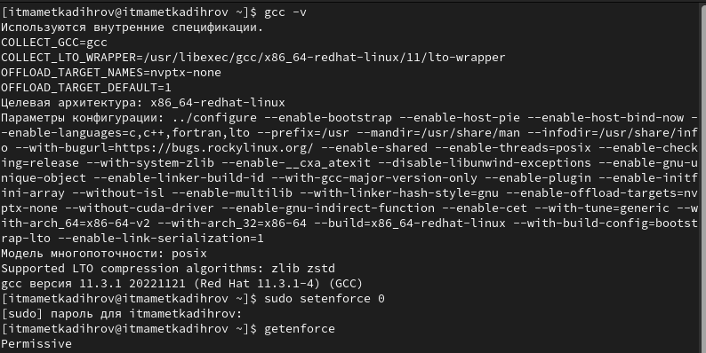{ #fig:001 width=70% }

Проверили успешное выполнение команд. (рис. [-@fig:002])

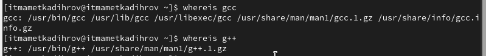{ #fig:002 width=70% }

Вошли в систему от имени пользователя guest командой “su - guest”. Создали программу simpleid.c командой “touch simpleid c” и открыли её в редакторе командой “gedit /home/guest/simpleid.c” (рис. [-@fig:003])

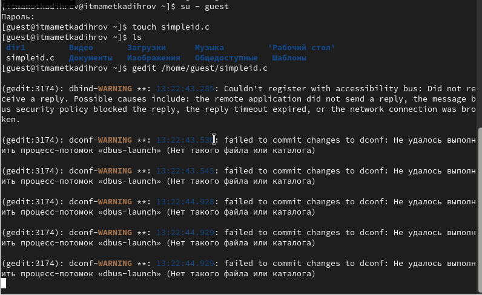{ #fig:003 width=70% }

Код программы выглядит следующим образом (рис. [-@fig:004]).

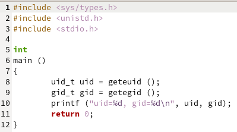{ #fig:004 width=70% }

Скомпилировали программу и убедились, что файл программы был создан командой “gcc simpleid.c -o simpleid”. Выполнили программу simpleid командой “./simpleid”, а затем выполнили системную программу id командой “id”. Результаты, полученные в результате выполнения обеих команд, совпадают (uid=1001 и
gid=1001) (рис. [-@fig:005]).

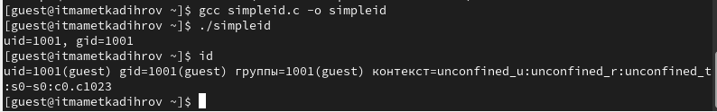{ #fig:005 width=70% }

Усложнили программу, добавив вывод действительных идентификаторов (рис. [-@fig:006]).

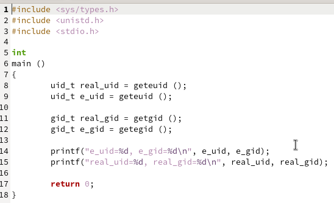{ #fig:006 width=70% }

Получившуюся программу назвали simpleid2.c (рис. [-@fig:007]).

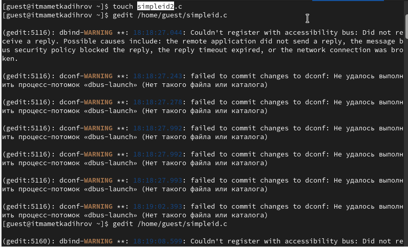{ #fig:007 width=70% }

Скомпилировали и запустили simpleid2.c командами “gcc simpleid2.c -o sipleid2” и “./simpleid2” (рис. [-@fig:008]).

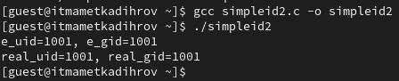{ #fig:008 width=70% }

От имени суперпользователя выполнили команды “sudo chown root:guest /home/guest/simpleid2” и “sudo chmod u+s /home/guest/simpleid2”, затем выполнили проверку правильности установки новых атрибутов и смены владельца файла simpleid2 командой “sudo ls -l /home/guest/simpleid2” (рис. [-@fig:009]). Этими командами была произведена смена пользователя файла на root и установлен SetUID-бит.

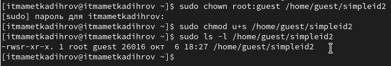{ #fig:009 width=70% }

Запустили программы simpleid2 и id. Теперь появились различия в uid (рис. [-@fig:010])

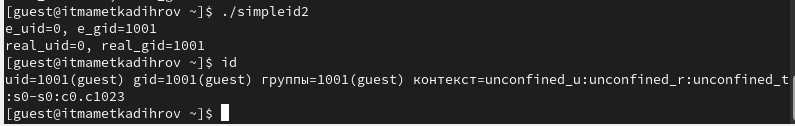{ #fig:010 width=70% }

Проделали тоже самое относительно SetGID-бита. Также можем заметить различия с предыдущим пунктом (рис. [-@fig:011]).

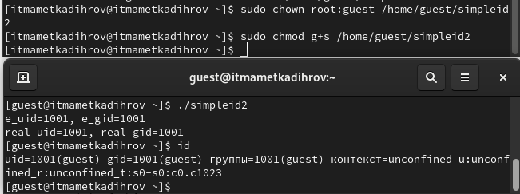{ #fig:011 width=70% }

Создаем программу readfile.c.

Скомпилировали созданную программу командой “gcc readfile.c -o readfile”. Сменили владельца у файла readfile.c командой “sudo chown root:guest /home/guest/readfile.c” и поменяли права так, чтобы только суперпользователь мог прочитать его, а guest не мог, с помощью команды “sudo chmod 700 /home/guest/readfile.c”. Теперь убедились, что пользователь guest не может прочитать файл readfile.c командой “cat readfile.c”, получив отказ в доступе (рис. [-@fig:012]).

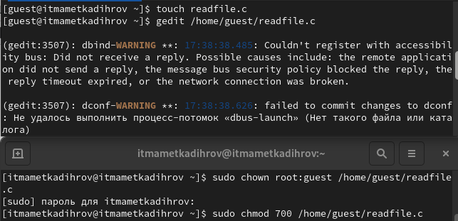{ #fig:012 width=70% }

Поменяла владельца у программы readfile и устанавила SetUID. Проверила, может ли программа readfile прочитать файл readfile.c командой “./readfile readfile.c”. Прочитать удалось.Аналогично проверила, можно ли прочитать файл /etc/shadow.
Прочитать удалось (рис. [-@fig:013]).

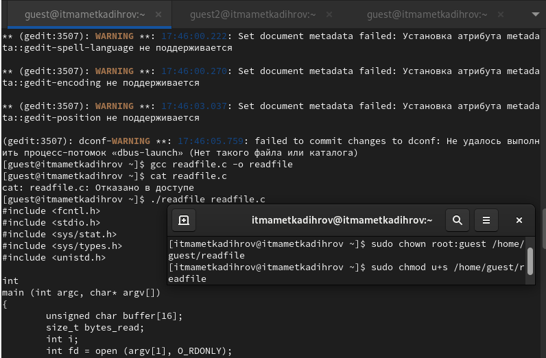{ #fig:013 width=70% }

## 3.2 Исследование Sticky-бита

Командой “ls -l / | grep tmp” убеждилась, что атрибут Sticky на директории /tmp установлен. От имени пользователя guest создала файл file01.txt в директории /tmp со словом test командой “echo”test” > /tmp/file01.txt”. Просматрела атрибуты у только что созданного файла и разрешаем чтение и запись для категории пользователей “все остальные” командами “ls -l /tmp/file01.txt” и “chmod o+rw /tmp/file01.txt” (рис. [-@fig:014]).

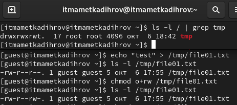{ #fig:014 width=70% }

От имени пользователя guest2 попробовали прочитать файл командой “cat /tmp/file01.txt” - это удалось. Далее попытались дозаписать в файл слово test2, проверить содержимое файла и записать в файл слово test3, стерев при этом всю имеющуюся в файле информацию - эти операции удалось выполнить только в случае, если еще дополнительно разрешить чтение и запись для группы пользователей командой “chmod g+rw /tmp/file01.txt”. От имени пользователя guest2 попробовали удалить файл - это не удается ни в каком из случаев, возникает ошибка (рис. [-@fig:015]).

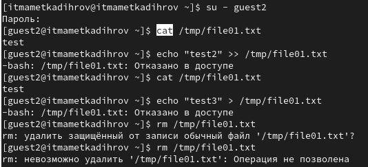{ #fig:015 width=70% }

Повысили права до суперпользователя командой “su -” и выполнили команду, снимающую атрибут t с директории /tmp “chmod -t /tmp”. После чего покинули режим суперпользователя командой “exit”. Повторили предыдущие шаги. Теперь мне удалось удалить файл file01.txt от имени пользователя, не являющегося его владельцем (рис. [-@fig:016]).

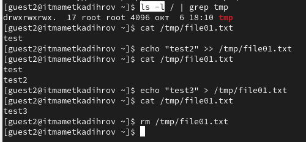{ #fig:016 width=70% }

Повысили свои права до суперпользователя и вернули атрибут t на директорию /tmp (рис. [-@fig:017]).

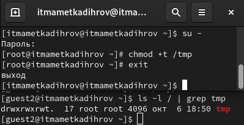{ #fig:017 width=70% }

# Выводы

В ходе выполнения данной лабораторной работы мы изучили механизмы изменения идентификаторов, применение SetUID- и Sticky-битов. Получили практические навыки работы в консоли с дополнительными атрибутами. Рассмотрели работу механизма смены идентификатора процессов пользователей, а также влияние бита Sticky на запись и удаление файлов.

# Список литературы{.unnumbered}

::: {#refs}
:::
