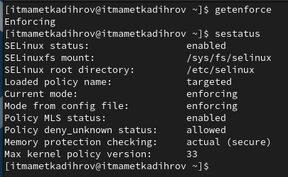
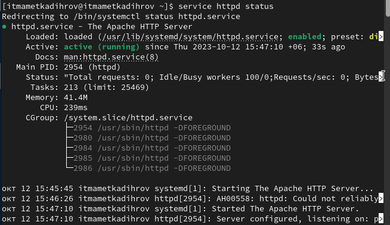
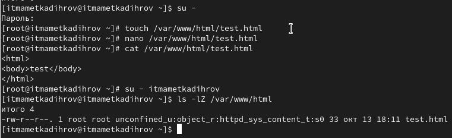
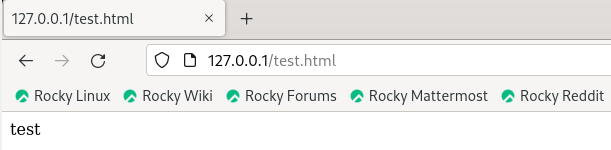
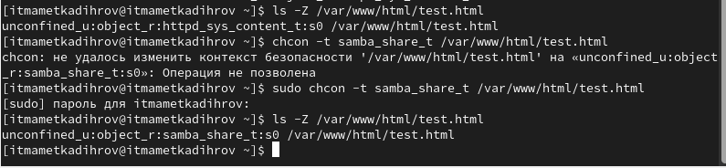
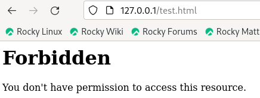
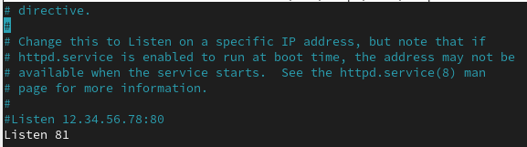
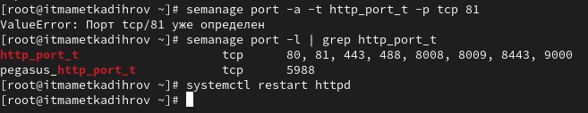
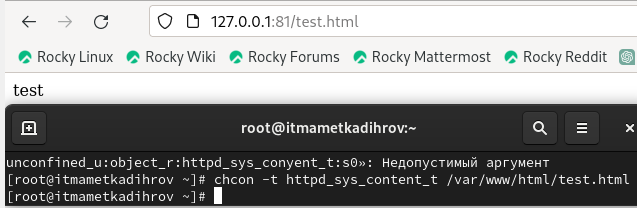

---
## Front matter
lang: russian
title: Отчет по лабораторной работе № 6
subtitle: Основы информационной безопасности
author: Маметкадыров Ынтымак
institute:
  - Российский университет дружбы народов, Москва, Россия
  - НПМбд-02-20

## Formatting
mainfont: PT Sans
romanfont: PT Sans
sansfont: PT Sans
monofont: PT Sans
toc: false
slide_level: 2
theme: metropolis
aspectratio: 43
section-titles: true

## Pandoc-crossref LaTeX customization
figureTitle: "Рис."
tableTitle: "Таблица"
listingTitle: "Листинг"
lofTitle: "Список иллюстраций"
lotTitle: "Список таблиц"
lolTitle: "Листинги"
---

## Цели лабораторной работы

1) Развить навыки администрирования ОС Linux
2) Получить первое практическое знакомство с технологией SELinux
3) Проверить работу SELinux на практике совместно с веб-сервером Apache.

## Задачи лабораторной работы
1) Проверить корректность работы SELinux, запустить веб-сервер Apache
2) Создать файл test.html
3) Обратиться к файлу через веб-сервер при разном контексте и порте

## Ход выполнения лабораторной работы
- Проверили, что SELinux работает в режиме enforcing политики targeted с помощью команд "getenforce" и "sestatus"

{ #fig:001 width=55% }

## Ход выполнения лабораторной работы
- Обратились с помощью браузера к веб-серверу, запущенному на нашем компьютере, и убедились, что последний работает с помощью команды "service httpd status" 

{ #fig:002 width=55% }

## Ход выполнения лабораторной работы
- От имени суперпользователя создали файл test.html. Обратились к нему через веб-сервер, введя адрес "http://127.0.0.1/test.html".

{ #fig:003 width=55% }

{ #fig:003 width=55% }

## Ход выполнения лабораторной работы
- Изменили контекст файла на samba_share_t. Попробовали получить доступ к файлу через веб-сервер и получили сообщение об ошибке

{ #fig:004 width=55% }

{ #fig:004 width=55% }

## Ход выполнения лабораторной работы
- В файле /etc/httpd/conf/httpd.conf заменили строчку "Listen 80" на "Listen 81", чтобы установить веб-сервер Apache на прослушивание TCP-порта 81

{ #fig:005 width=80% }

## Ход выполнения лабораторной работы
- Выполнили команду "semanage port -a -t http_port_t -р tcp 81" и убедились, что порт TCP-81 установлен. Проверили список доступных портов

{ #fig:006 width=80% }

## Ход выполнения лабораторной работы
- Вернули контекст "httpd_sys_cоntent_t" файлу test.html и попробовали получить доступ к файлу через веб-сервер, введя адрес "http://127.0.0.1:81/test.html"

{ #fig:007 width=55% }

## Вывод
- В ходе выполнения данной лабораторной работы мы развили навыки администрирования ОС Linux, получили первое практическое знакомство с технологией SELinux и проверили работу SELinux на практике совместно с веб-сервером Apache.

