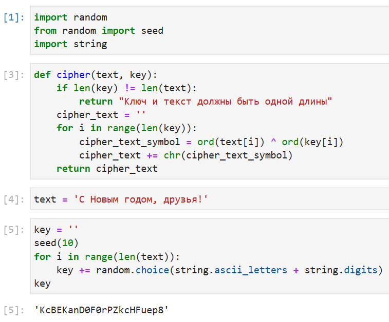
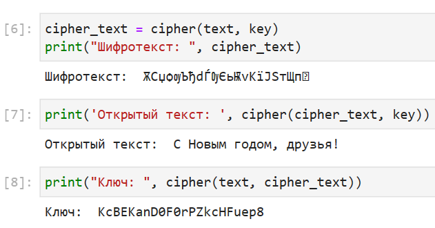

---
## Front matter
lang: russian
title: Отчет по лабораторной работе № 7
subtitle: Основы информационной безопасности
author: Маметкадыров Ынтымак
institute:
  - Российский университет дружбы народов, Москва, Россия
  - НПМбд-02-20

## Formatting
mainfont: PT Sans
romanfont: PT Sans
sansfont: PT Sans
monofont: PT Sans
toc: false
slide_level: 2
theme: metropolis
aspectratio: 43
section-titles: true

## Pandoc-crossref LaTeX customization
figureTitle: "Рис."
tableTitle: "Таблица"
listingTitle: "Листинг"
lofTitle: "Список иллюстраций"
lotTitle: "Список таблиц"
lolTitle: "Листинги"
---

## Цели лабораторной работы

1) Освоить на практике применение режима однократного гаммирования.

## Задачи лабораторной работы
1) Написать программу на языке Python, реализующую режим однократного гаммирования.

## Ход выполнения лабораторной работы
- In[1]: импорт необходимых библиотек
- In[3]: функция, реализующая сложение по модулю два двух строк
- In[4]: открытый/исходный текст
- In[5]: создание ключа той же длины, что и открытый текст

{ #fig:001 width=45% }

## Ход выполнения лабораторной работы
- In[6]: получение шифротекста, при условии, что известны открытый текст и ключ
- In[7]: получение открытого текста, при условии, что известны шифротекст и ключ
- In[8]: получение ключа, при условии, что известны открытый текст и шифротекст

{ #fig:002 width=55% }

## Вывод
- В ходе выполнения данной лабораторной работы мы освоили на практике применение режима однократного гаммирования.

