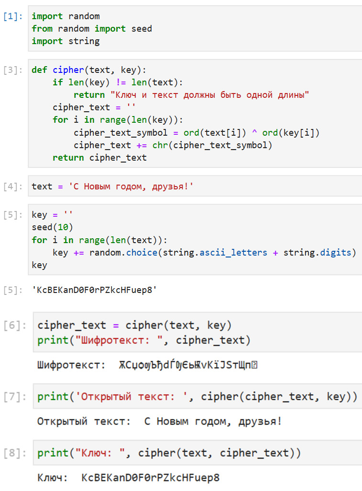

---
## Front matter
title: "Лабораторная работа №7"
subtitle: "Информационная безопасность"
author: "Маметкадыров Ынтымак | НПМбд-02-20"

## Generic otions
lang: ru-RU
toc-title: "Содержание"

## Bibliography
bibliography: bib/cite.bib
csl: pandoc/csl/gost-r-7-0-5-2008-numeric.csl

## Pdf output format
toc: true # Table of contents
toc-depth: 2
lof: true # List of figures
fontsize: 12pt
linestretch: 1.5
papersize: a4
documentclass: scrreprt
## I18n polyglossia
polyglossia-lang:
  name: russian
  options:
	- spelling=modern
	- babelshorthands=true
polyglossia-otherlangs:
  name: english
## I18n babel
babel-lang: russian
babel-otherlangs: english
## Fonts
mainfont: PT Serif
romanfont: PT Serif
sansfont: PT Sans
monofont: PT Mono
mainfontoptions: Ligatures=TeX
romanfontoptions: Ligatures=TeX
sansfontoptions: Ligatures=TeX,Scale=MatchLowercase
monofontoptions: Scale=MatchLowercase,Scale=0.9
## Biblatex
biblatex: true
biblio-style: "gost-numeric"
biblatexoptions:
  - parentracker=true
  - backend=biber
  - hyperref=auto
  - language=auto
  - autolang=other*
  - citestyle=gost-numeric
## Pandoc-crossref LaTeX customization
figureTitle: "Рис."
tableTitle: "Таблица"
listingTitle: "Листинг"
lofTitle: "Список иллюстраций"
lotTitle: "Список таблиц"
lolTitle: "Листинги"
## Misc options
indent: true
header-includes:
  - \usepackage{indentfirst}
  - \usepackage{float} # keep figures where there are in the text
  - \floatplacement{figure}{H} # keep figures where there are in the text
---

# Цель работы

Освоить на практике применение режима однократного гаммирования.

# Теоретическое введение

Гаммирование - наложение (снятие) на открытые (зашифрованные) данные последовательности элементов других данных, полученной с помощью некоторого криптографического алгоритма, для получения зашифрованных (открытых) данных. 

Основная формула, необходимая для реализации однократного гаммирования: Ci = Pi  XOR  Ki, где Ci - i-й символ зашифрованного текста, Pi - i-й символ открытого текста, Ki - i-й символ ключа. 

Аналогичным образом можно найти ключ: Ki = Ci  XOR  Pi.

Необходимые и достаточные условия абсолютной стойкости шифра:

* длина открытого текста равна длине ключа
* ключ должен использоваться однократно
* ключ должен быть полностью случаен

Более подробно см. в [@Gamma:bash].

# Выполнение лабораторной работы

Код программы (рис. [-@fig:001]).
 
{ #fig:001 width=85% }

* In[1]: импорт необходимых библиотек
* In[3]: функция, реализующая сложение по модулю два двух строк
* In[4]: открытый/исходный текст
* In[5]: создание ключа той же длины, что и открытый текст
* In[6]: получение шифротекста с помощию функции, созданной ранее, при условии, что известны открытый текст и ключ
* In[7]: получение открытого текста с помощью функции, созданной ранее, при условии, что известны шифротекст и ключ
* In[8]: получение ключа с помощью функции, созданной ранее, при условии, что известны открытый текст и шифротекст

# Выводы

В ходе выполнения данной лабораторной работы мы освоили на практике применение режима однократного гаммирования.

# Список литературы{.unnumbered}

::: {#refs}
:::

