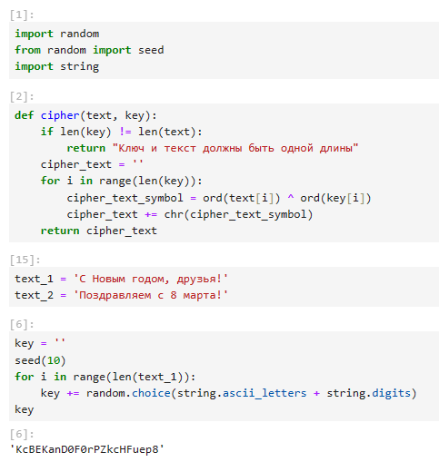
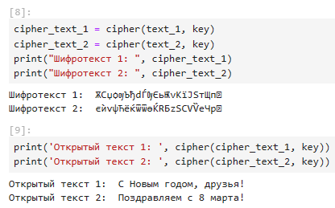
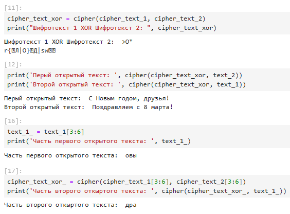

---
## Front matter
lang: russian
title: Отчет по лабораторной работе №8
subtitle: Основы информационной безопасности
author: Маметкадыров Ынтымак
institute:
  - Российский университет дружбы народов имени Патриса Лумумбы, Москва, Россия
  - НПМбд-02-20

## Formatting
mainfont: PT Sans
romanfont: PT Sans
sansfont: PT Sans
monofont: PT Sans
toc: false
slide_level: 2
theme: metropolis
aspectratio: 43
section-titles: true

## Pandoc-crossref LaTeX customization
figureTitle: "Рис."
tableTitle: "Таблица"
listingTitle: "Листинг"
lofTitle: "Список иллюстраций"
lotTitle: "Список таблиц"
lolTitle: "Листинги"
---

## Цели лабораторной работы

1) Освоить на практике применение режима однократного гаммирования на примере кодирования различных исходных текстов одним ключом.

## Задачи лабораторной работы
1) Написать программу на языке Python, реализующую режим однократного гаммирования для двух текстов, кодируемых одним ключом.

## Ход выполнения лабораторной работы
- In[1]: импорт необходимых библиотек
- In[2]: функция, реализующая сложение по модулю два двух строк
- In[15]: открытые/исходные тексты (одинаковой длины)
- In[6]: создание ключа той же длины, что и открытые тексты

{ #fig:001 width=45% }

## Ход выполнения лабораторной работы
- In[8]: получение шифротекстов при условии, что известны открытые тексты и ключ
- In[9]: получение открытых текстов при условии, что известны шифротексты и ключ

{ #fig:002 width=55% }

## Ход выполнения лабораторной работы
- In[11]: сложение по модулю два двух шифротекстов
- In[12]: получение открытых текстов при условии, что известны оба шифротекста и один из открытых текстов
- In[16]: получение части первого открытого текста (срез)
- In[17]: получение части второго текста при условии, что известны оба шифротекста и часть первого открытого текста

{ #fig:003 width=55% }

## Вывод
- В ходе выполнения данной лабораторной работы мы освоили на практике применение режима однократного гаммирования на примере кодирования различных исходных текстов одним ключом.

